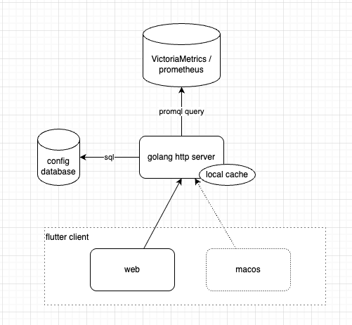
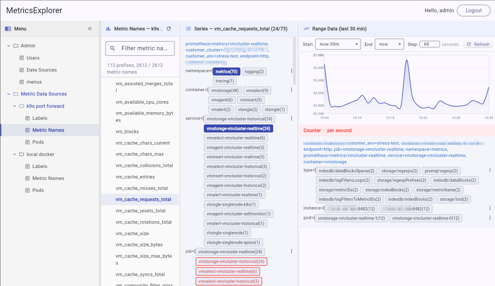
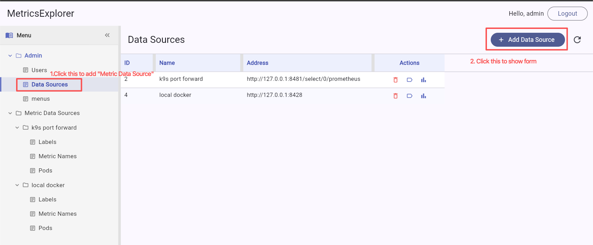
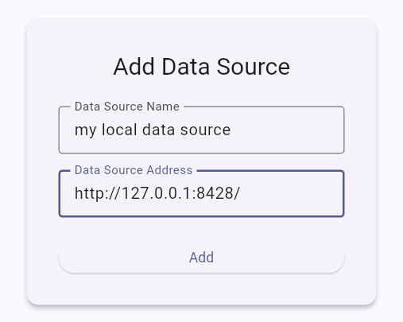

# Metrics Explorer

Metric Explorer is a client application for browsing metrics that supports the VictoriaMetric/prometheus protocol.

(Currently supports web, Android, and macOS)

Release page: https://github.com/ahfuzhang/MetricsExplorer/releases/tag/v0.1.0

## Background

In the `Observability` domain, applications report the summaries over a period of time to the time-series database using the following metric format:

```
http_request_total{tag1="value1", tag2="value2"} $sumValue $timestamp
```

Then, we need to use a query language like PromQL / MetricsQL to calculate the time-series data:

```promql
sum by (path) (increase(http_request_total{tag1="$filter1", tag2="$filter2"}[1m]))
```

Finally, we create a dashboard using Grafana and see a chart about the request curve.

However, when there are many metrics, configuring various charts one by one is time-consuming and tedious.

To address this, the metrics explorer tool provides different entry points to browse all the metrics data and offers rich filtering and charting features, ultimately eliminating the burden of creating dashboards.

## Architecture



## UI




## AI Statement

* Flutter UI layout was primarily generated using AI.
* Client-side API call logic and data sorting logic were discussed with AI, but AI-generated code was not used directly.
* Golang server-side code was discussed with AI, but AI-generated code was not used directly.

## How to install

### mysql

* Start mysql via docker:
  - see: `./server/mysql/Makefile`

```bash
mkdir -p ~/Downloads/metrics_explorer/
docker run -d \
    --name mysql-for-metrics-explorer \
    -e MYSQL_ROOT_PASSWORD=123456 \
    -e MYSQL_DATABASE=metrics_explorer \
    -p 3306:3306 \
    -v ~/Downloads/metrics_explorer/:/var/lib/mysql \
    --restart unless-stopped \
    mysql:8.0
```

* create table

```bash
mysql -h 127.0.0.1 -P 3306 -uroot -p123456 < ./server/mysql/admin.sql
mysql -h 127.0.0.1 -P 3306 -uroot -p123456 < ./server/mysql/victoria_metrics_data_source.sql
```

### VictoriaMetrics (time-series database)

```bash
mkdir -p ~/Downloads/VictoriaMetricsData/
docker run -d --rm --name victoriametrics \
  -p 8428:8428 \
  --cpuset-cpus="0" \
  -m 128m \
  -v ~/Downloads/VictoriaMetricsData/:/storage/ \
  -e GOMAXPROCS=1 \
  victoriametrics/victoria-metrics:v1.115.0 \
  -storageDataPath=/storage/ \
  -inmemoryDataFlushInterval=30s \
  -memory.allowedPercent=80 \
  -retentionPeriod=2d \
  -httpListenAddr=:8428 \
  -pushmetrics.extraLabel='pod="vm-single-20260607"' \
  -pushmetrics.interval=10s \
  -pushmetrics.url="http://host.docker.internal:8428/api/v1/import/prometheus"
```

If VictoriaMetrics or Prometheus is already deployed in your work environment, you can skip this step.

### Build web static files

```bash
make build_web
```

### Build golang server

```bash
cd ./server/MetricsExplorerServer/
make build
```

### Set config file

Edit `./server/MetricsExplorerServer/MetricsExplorerServer.yaml`

* Key configs:
  - mysql dsn: mysql data source name
  - http server port
  - admin name and password (default is admin/admin)

### Run server

```bash
cd ./server/MetricsExplorerServer/
make run
```

### Open in chrome browser

use chrome to visit: `http://127.0.0.1:8099/metrics_explorer/`

### Add metric database

* Go to `List Data source page`




* Click the "Add Data Source" button in the upper right corner.



Then refresh page, you will see the metric data source.


# License

This project is licensed under the [MIT License](LICENSE).

Copyright (c) 2026 Fuchun Zhang
